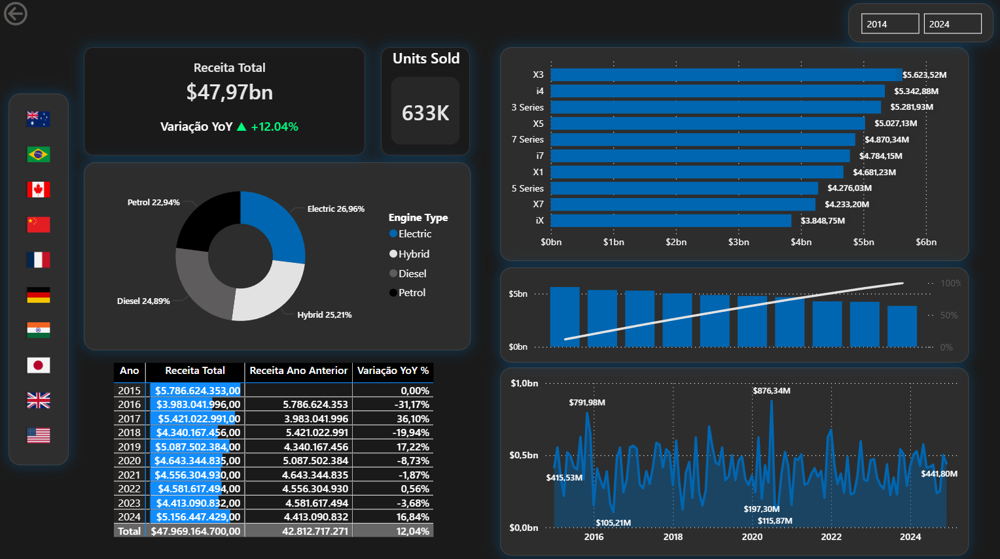

# 🚗 Análise Global de Vendas e Influência Energética - BMW

## 📌 Visão Geral
Projeto completo de Business Intelligence e Análise de Dados focado em mapear o pipeline de vendas globais da BMW (2014-2024). O objetivo principal foi realizar a extração e o tratamento de dados brutos utilizando Python e SQL, gerando um modelo estruturado para consumo no Power BI. O dashboard final avalia os fatores de influência na compra de veículos, com destaque para o impacto da transição energética (preferências por veículos elétricos, híbridos e a combustão).

## 📊 Visualização do Dashboard

## 🛠️ Tecnologias Utilizadas
* **Python (Pandas):** Limpeza de dados, formatação de datas, remoção de duplicatas e engenharia de features (cálculo de faturamento total).
* **SQLite3 & SQL:** Banco de dados em memória para integração, modelagem estruturada e consultas de agregação.
* **Power BI:** Construção do relatório visual, modelagem de dados e criação de medidas DAX.

## ⚙️ Principais Funcionalidades e KPIs
* **Cartões de KPI Avançados:** Acompanhamento de Receita Total ($47.97bn), Unidades Vendidas (633K) e Variação YoY (+12.04%).
* **Análise de Influência Energética:** Gráfico de rosca detalhando a distribuição de vendas por tipo de motor (Electric 26.96%, Hybrid 25.21%, Diesel 24.89%, Petrol 22.94%).
* **Top Performers:** Ranking interativo dos modelos que mais geram receita (X3, i4, 3 Series, etc.).
* **Filtros Dinâmicos:** Segmentação de dados rápida por país (via menu lateral de bandeiras) e recortes temporais (2014 a 2024).

## 🚀 Como Executar o ETL
1. Clone este repositório.
2. Certifique-se de ter a biblioteca `pandas` instalada (`pip install pandas`).
3. Adicione o arquivo de dados original `bmw_global_sales_dataset.csv` na raiz do projeto (não incluso no repositório por questões de tamanho/versionamento).
4. Execute o script principal: `python etl_bmw_sales.py`.
5. O terminal exibirá o Top 10 de vendas e o arquivo limpo `bmw_sales_cleaned.csv` será gerado automaticamente para uso no Power BI.
